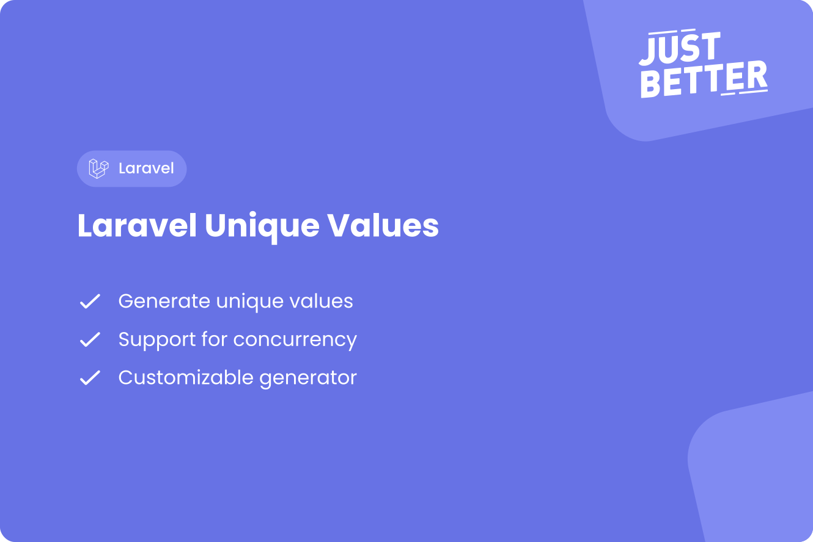

<a href="https://github.com/justbetter/laravel-unique-values" title="JustBetter">
    
</a>

# Package to generate unique values

<p>
    <a href="https://github.com/justbetter/laravel-unique-values"></a>
    <a href="https://github.com/justbetter/laravel-unique-values"></a>
    <a href="https://github.com/justbetter/laravel-unique-values"></a>
    <a href="https://github.com/justbetter/laravel-unique-values"></a>
</p>

This package generates persistent unique values with support for concurrency utilizing scoped cache locking.
It stores generated unique values in the database.

Generated values are unique per scope and can be generated using a callback method.
This package only supports strings.

## Features

- Generate unique values
- Support for concurrency
- Customizable generator
- Maximum attempts
- Support for subjects

## Installation

You can install the package via composer:

```shell
composer require justbetter/laravel-unique-values
```

## Usage

```php
use JustBetter\UniqueValues\Support\UniqueValue;

$uniqueValue = UniqueValue::make()
    ->scope('unique-scope')
    ->generator(function (int $attempt): string {
        return match ($attempt) {
            0 => 'unique-value',
            default => 'unique-value-'.$attempt,
        };
    })->generate();
```

Output after first run: `unique-value`.
Output after second run: `unique-value-1`.
Output after third run: `unique-value-2`.

### Maximum attempts

You can configure the maximum attempts, this is three by default.
If the maximum attempts are reached an exception is thrown.

```php
use JustBetter\UniqueValues\Support\UniqueValue;

$uniqueValue = UniqueValue::make()
    ->scope('unique-scope')
    ->attempts(2)
    ->generator(function (int $attempt): string {
        return match ($attempt) {
            0 => 'unique-value',
            default => 'unique-value-'.$attempt,
        };
    })->generate();
```

### Subject

You can add a subject to retrieve a previously generated value for the subject.
Optionally you can add an override flag to run the generation again for the subject.


```php
use JustBetter\UniqueValues\Support\UniqueValue;

$uniqueValue = UniqueValue::make()
    ->scope('unique-scope')
    ->subject('subject')
    ->generator(function (int $attempt): string {
        return match ($attempt) {
            0 => 'unique-value',
            default => 'unique-value-'.$attempt,
        };
    })->generate();
```

First run will output: `unique-value`.
Second run will output: `unique-value`.
Only one unique value will be stored in the database.

## Quality

To ensure the quality of this package, run the following command:

```shell
composer quality
```

This will execute three tasks:

1. Makes sure all tests are passed
2. Checks for any issues using static code analysis
3. Checks if the code is correctly formatted

## Contributing

Please see [CONTRIBUTING](.github/CONTRIBUTING.md) for details.

## Security Vulnerabilities

Please review [our security policy](../../security/policy) on how to report security vulnerabilities.

## Credits

- [Vincent Boon](https://github.com/VincentBean)
- [Ramon Rietdijk](https://github.com/ramonrietdijk)
- [All Contributors](../../contributors)

## License

The MIT License (MIT). Please see [License File](LICENSE) for more information.

<a href="https://justbetter.nl" title="JustBetter">
    
</a>
